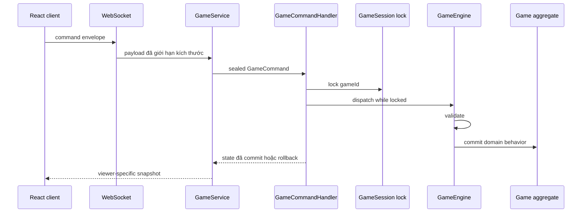

# Kiến trúc và OOP

CoinCard có Java authoritative backend và React client. WebSocket thuần tại
`/ws`; client không tự tính kết quả command.

## Các lớp chính

- `game/Game`: aggregate root, sở hữu hai `Player`, turn state và invariant.
- `game/Player`, `Hero`, `Minion`, `Deck`: state và behavior domain; `Hero`/`Minion`
  cùng kế thừa abstract `model/GameCharacter`.
- `game/GameCommand`: sealed command hierarchy; `GameCommandHandler` là dispatcher
  duy nhất trước `GameEngine`.
- `game/GameSession`, `GameSessionRegistry`: sở hữu lock theo aggregate; handler
  lấy đúng một session và tạo snapshot khi lock còn giữ.
- `game/GameEngine`: domain service stateless validate, commit, winner check và rollback.
- `game/GameMemento`: snapshot bất biến của player và toàn bộ turn/status state cho command nhiều effect.
- `game/CardEffect`, `EffectStrategy`, `EffectFactory`, `EffectResolver`: Strategy
  registry cho card effects; registry nhận danh sách strategy qua constructor.
- `game/HeroPower`, `HeroPowerRegistry`: Strategy cho năm hero power; registry
  nhận danh sách strategy qua constructor.
- `game/DeckFactory`, `GameFactory`: tạo deck/game sau validation.
- `application/LoadoutService`, `MatchService`, `CommandExecutionService`, `CleanupService`:
  application use cases tách theo loadout, tạo trận, command và cleanup.
- `net/GameService`, `service/RoomService`, `GamePersistenceService`: WebSocket-facing
  facade, room lifecycle và persistence tách trách nhiệm.
- `db/Repositories`: `CatalogRepository` và `GameResultRepository` là ports; JDBC là
  adapter trong `JdbcRepositories`.
- `mapper/GameStateMapper`: viewer-specific snapshot mapping.
- `net/OutboundGameGateway`: application port cho outbound event/session message;
  `ws/WebSocketOutboundGateway` và `WebSocketSessionRegistry` là adapter sở hữu
  socket, serialization và routing transport.

## Luồng command

`GameCommandHandler` khóa từng `GameSession`; caller và concurrency test không cần
`synchronized(game)`. Room vẫn có lock riêng cho lifecycle/loadout. Executor dùng
cho start/rematch là executor managed bởi Spring/runtime flow, không dùng common
pool cho gameplay command. `WebSocketConfig` tách khỏi domain bean factory nên
WebSocket handler không tạo vòng dependency Spring.

## OOP và patterns

| Nguyên lý/pattern | Implementation production |
| --- | --- |
| Encapsulation | Aggregate mutation qua behavior, collection immutable view |
| Inheritance/LSP | `GameCharacter` -> `Hero`, `Minion` |
| Strategy | `CardEffect`, `EffectStrategy`, `EffectFactory`, `HeroPower`, `HeroPowerRegistry` |
| Command | sealed `GameCommand` + `GameCommandHandler` |
| Factory | `DeckFactory`, `GameFactory` (production-only aggregate construction) |
| Memento | `GameMemento` restore player/deck/character và turn/status state |
| Repository/DIP | `CatalogRepository`, `GameResultRepository` -> JDBC adapter |
| SRP | room, match, persistence, mapping, WebSocket registry tách riêng |

## Viewer-specific state

`GameStateMapper` không gửi hand đối thủ; chỉ player sở hữu hand mới nhận card
details. Room snapshot chỉ chứa `heroClass`, `deckReady`, `connected`, không chứa
deck của đối thủ. Catalog được đọc một lần qua repository và lọc token trước khi
trả cho deck builder.

## Persistence và cleanup

Game đang chơi nằm trong RAM. Kết quả đã kết thúc được ghi vào SQLite qua
`GameResultRepository`; restart không khôi phục game đang chơi. Room offline quá TTL bị
cleanup cùng game index và persistence marker.
