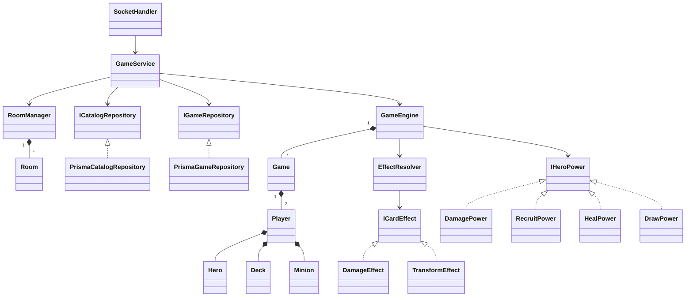
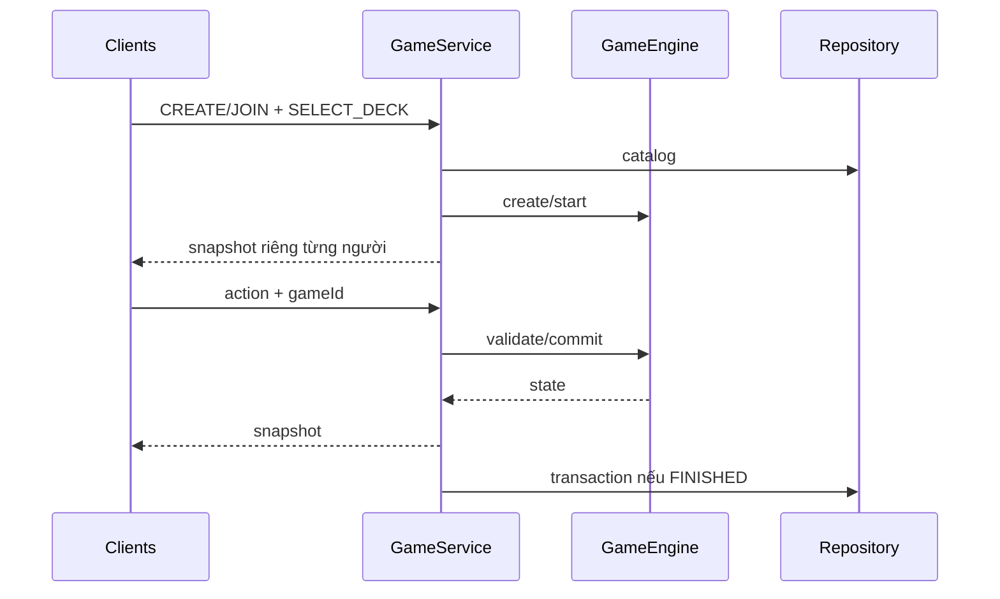

# Kiến trúc và OOP

Monorepo: client React/Vite, server Express/Socket.IO, shared DTO/events. Server quyết định luật và chỉ gửi mỗi người tay bài của họ.

- network/SocketHandler.ts: validate payload, bắt lỗi, inject repository.
- network/GameService.ts: xác thực token/socket/game hiện tại, khóa start/rematch, snapshot, lưu kết quả, cleanup.
- room/Room.ts và RoomManager.ts: membership, hero/ready, vote và index token/socket.
- game/GameEngine.ts: validate → checkpoint → commit; lỗi hoàn tác hai Player.
- Game/Player/Hero/Minion/Deck: trạng thái private và hành vi domain.
- EffectResolver: chọn/kiểm tra target, registry ICardEffect; strategy trong game/effects.
- HeroPower.ts: registry IHeroPower với validate/execute.
- database/repositories.ts: ICatalogRepository/IGameRepository và adapter Prisma, transaction kết quả.
- Client socketService giữ một socket/tab; useConnection theo dõi kết nối; gameStore giữ sessionStorage; screens chuyển theo snapshot PLAYING/FINISHED.

## Đánh giá
Có encapsulation, abstraction, composition và polymorphism thực tế. Hand/catalog được sao chép sâu; collection board/game được sao chép readonly, entity vẫn có method mutable phục vụ engine. Getter RoomPlayer trả bản sao, thay đổi membership qua method. TypeScript private/readonly là kiểm tra biên dịch, không phải sandbox.

GameService phụ thuộc interface thay vì Prisma. Effect/power mở rộng qua strategy. React hooks, DTO, combat function không cần ép thành class. GameService vẫn gom nhiều tác vụ vòng đời; chưa tách thành session state machine độc lập. Không khẳng định tuyệt đối mọi nguyên tắc SOLID.

## UML

Game/phòng ở RAM. Phòng cả hai offline ≥10 phút được quét mỗi phút. Restart không phục hồi trận đang chơi. Kết quả lưu lỗi retry hai lần; chưa có durable queue qua crash.

