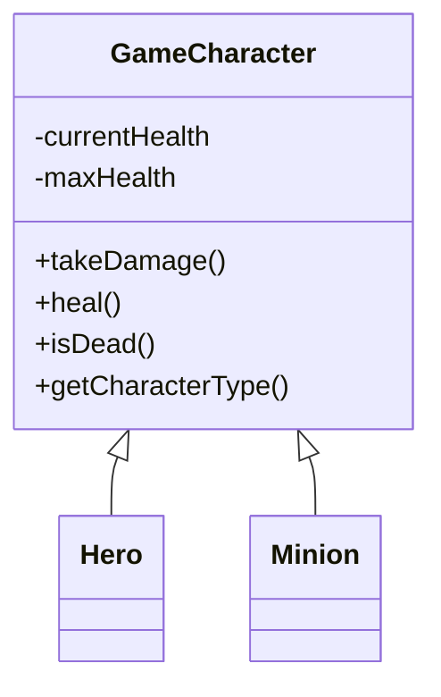
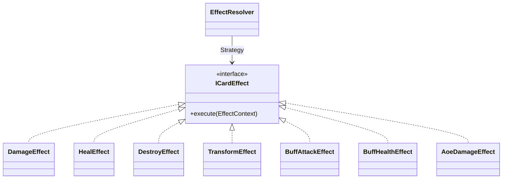
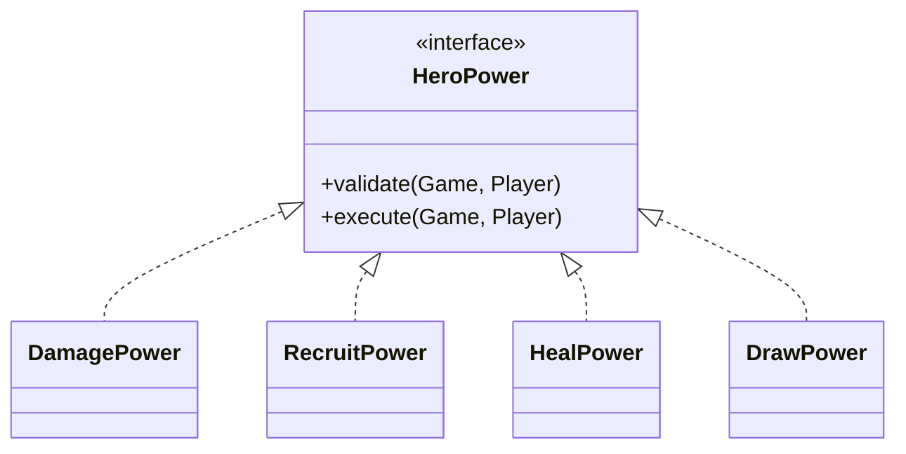
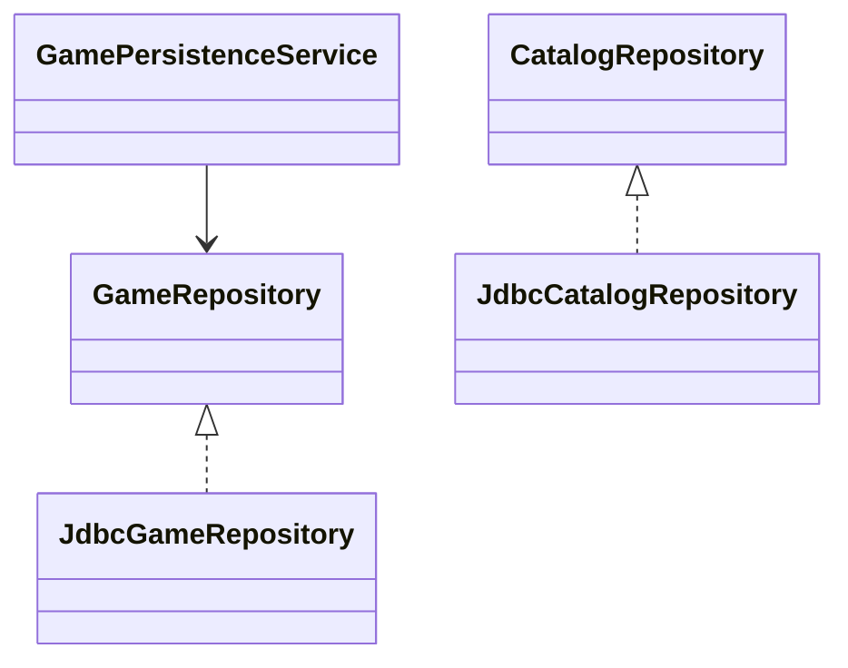
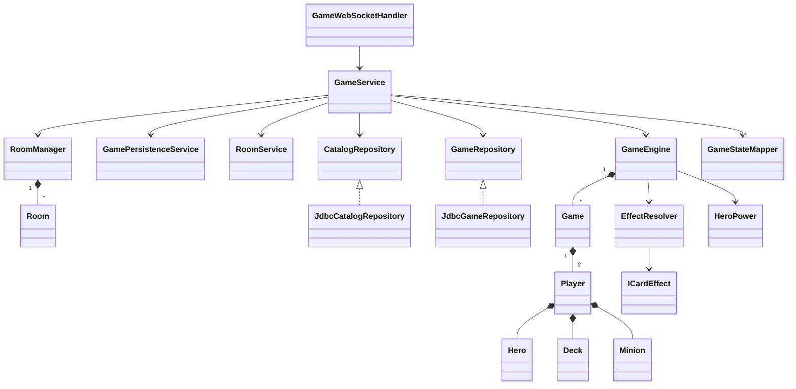
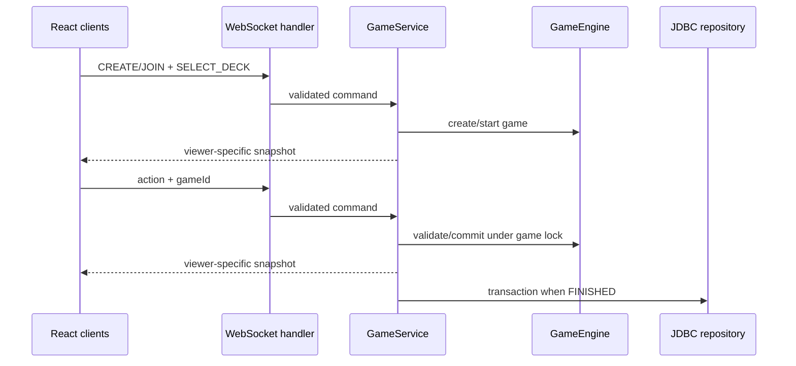

# Kiến trúc và OOP

CoinCard gồm Spring Boot backend authoritative và React browser client. Hai phía
giao tiếp qua WebSocket thuần tại `/ws`; client không tự tính kết quả action.

## Backend Java (Java là trung tâm)

- `model/GameCharacter.java` (abstract) ← `Hero` / `Minion` : Inheritance, `takeDamage/heal/isDead` chung.
- `game/`: `Game`, `Player`, `Deck` và `GameEngine` (validate → checkpoint → commit, Memento).
- `game/effects/`: `ICardEffect` (EffectStrategy) + 10 strategy `Damage/Heal/Buff/Transform/...` : Strategy + Polymorphism.
- `game/HeroPower.java`: registry Strategy cho 5 hero power.
- `combat/CombatService.java`: luật Charge, Taunt, minion chắn hero và damage đồng thời.
- `mapper/GameStateMapper.java`: tập trung serialize `Hero/Minion/Card/Player/Game/Room` — SRP, tách khỏi domain.
- `service/GameService` (gameplay) / `RoomService` (phòng) / `GamePersistenceService` (lưu DB) : SRP.
- `room/`: phòng hai người, reconnect token, rematch vote và index O(1).
- `net/GameService`: xác thực session/socket/game, khóa `synchronized(game)` mutation, snapshot riêng viewer.
- `ws/GameWebSocketHandler`: validate envelope `{event, data}` và route action, không chứa business logic.
- `db/`: `CatalogRepository`/`GameRepository` (abstraction) → `JdbcCatalogRepository`/`JdbcGameRepository` : Repository + DIP, JDBC giữ nguyên.

Action trong `GameEngine` đi theo thứ tự validate -> checkpoint -> commit. Nếu
effect sau thất bại, checkpoint phục hồi hand, mana, board, deck, hero và thống kê.
Collection/domain state không được sửa trực tiếp từ network layer.

## Frontend

- `CompatSocket` quản lý WebSocket và reconnect trong mỗi tab.
- `socketService` là cổng duy nhất để component gửi action.
- `gameStore` giữ session trong `sessionStorage`; mỗi tab có session riêng.
- UI chuyển màn dựa trên snapshot `PLAYING`/`FINISHED` từ server.
- Hand đối thủ không được gửi trong snapshot, thay vì chỉ ẩn bằng CSS.

## UML

Game/phòng đang chơi nằm trong RAM. Phòng cả hai offline quá thời hạn sẽ được dọn.
Restart server không phục hồi trận đang chơi; kết quả đã kết thúc nằm trong SQLite.
